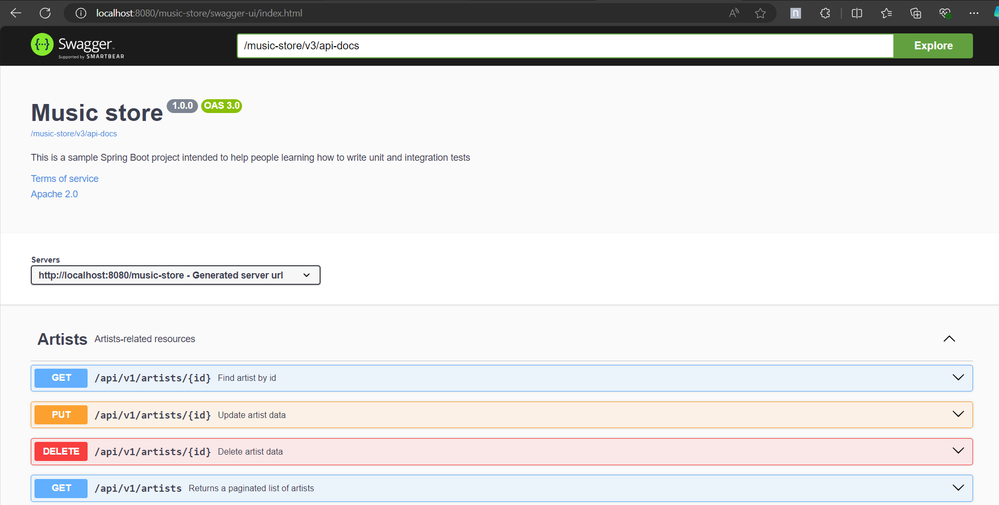

# Spring Boot Integration Testing

# Table of Contents
1. [Overview](#1-overview)
2. [About the application](#2-about-the-application)
   1. [Database schema](#database-schema)
3. [Environment prerequisites](#3-environment-prerequisites)
4. [Build instructions](#4-build-instructions)
5. [About integration testing](#about-integration-testing)
6. [Instructions](#instructions)

## 1. Overview

This repository is intended to provide a sample Spring Boot project for those who wish to learn and practice integration testing. The main idea is to provide a “playground”, 
so that whoever makes use of this repository only focuses on implementing tests without worrying about developing the functionality of the application.
Explanations will be provided on the importance of  integration testing, as well as examples and proposed exercises to practice.

## 2. About the application

This sample project is a simple Spring Boot project emulating a music store. It exposes REST APIs to execute CRUD operations over resources like Artists, Albums and Songs.  
It uses an in-memory database called H2, so you'll find pre-existing data examples.

### Database schema

### 3. Environment prerequisites

1. Install [JDK 21](https://adoptium.net/temurin/releases/)

## 4. Build instructions

1. Fork this repository
2. Once fork is complete, clone the repository.
3. Open the project with your favourite editor/IDE (Eclipse, VSCode, IntelliJ, etc.).
4. Open a new terminal, move to the project's location and execute the command `.\gradlew clean build` and wait for completion
5. Finally, execute the application using your editor/IDE or executing `.\gradlew bootRun`

If you want to verify application is running you can open the: [Swagger documentation](http://localhost:8080/music-store/swagger-ui/index.html)

You should see something like this:

Here, you'll find the resources to execute CRUD operations for Artists, Albums and Songs. For example,
you can get the lists of artists:

1. In the artists section look for the GET API "Returns a paginated list of artists", click on it and then click on the `Try it out` option.

2. Then click on `Execute` option.

3. You should see a list of artists

## 5. About integration testing

Integration Testing is a form of testing focused in testing interactions between internal and external components, but not as a whole
system or flow. Some examples of external components are databases, external services, files, etc. Unlike unit tests, integration tests
don't simulate or mock interactions with external components, allowing to catch bugs that can't be caught with unit tests.

One disadvantage that integration tests have, is that they're more complicated to execute since previous configuration is needed in
order to interact with the external components. They're slow and takes more time to execute them.

In this demo project will be focusing on writing integration tests to test the persistence layer (repositories) and presentation
layer (controllers).

## 6. Instructions

As mentioned before, we'll focus on testing persistence and presentation layers. To write and execute the tests, we'll make use
of a library called [JUnit](https://www.baeldung.com/junit-5) and we'll use an assertion library called [AssertJ](https://www.baeldung.com/introduction-to-assertj), 
Below you'll find a list of explanations and proposed exercises, please follow them in that order.

> 💡 **IMPORTANT**
> 
> We'll be working on the `main` branch but if you take a look, there's another branch called `ending_branch` this branch contains more implementation examples
> for the suggested exercises, you can use this branch to compare it with your tests in case you get stuck, but ideally you should try to solve the exercises by your own
> by making google searches and investigating so you can really develop an understanding of the subject.

### Exercises

#### Testing persistence layer

1. [Testing `AlbumRepository`](markdown/album-repository-exercises.md#testing-albumrepository)
2. [Testing `ArtistRepository`](markdown/artist-repository-exercises.md#testing-artistrepository)
3. [Testing `SongRepository`](markdown/song-repository-exercises.md#testing-songrepository)

#### Testing persistence layer

1. [Testing `ArtistController`](markdown/artist-controller-exercises.md#testing-artistcontroller)
2. Testing `AlbumnController` - [same instructions as `ArtistController`](markdown/artist-controller-exercises.md#testing-artistcontroller)
3. Testing `SongController` - [same instructions as `ArtistController`](markdown/artist-controller-exercises.md#testing-artistcontroller)

## 7. Resources

### Official Language/Framework/Library Documentation

- [Testing Spring Boot Applications](https://docs.spring.io/spring-boot/reference/testing/spring-boot-applications.html)
- [Testing the Web layer](https://spring.io/guides/gs/testing-web)
- [`@DataJpaTest` annotation](https://docs.spring.io/spring-boot/api/java/org/springframework/boot/test/autoconfigure/orm/jpa/DataJpaTest.html)

### Blog articles, samples

- [`@SpringBootTest` annotation](https://howtodoinjava.com/spring-boot2/testing/springboottest-annotation/)
- [Spring Boot Integration Testing](https://www.arhohuttunen.com/spring-boot-integration-testing/)
- [Spring Boot `@DataJpaTest`](https://zetcode.com/springboot/datajpatest/)

### Video tutorials

- [Spring Boot Testing](https://www.youtube.com/watch?v=rUbjV3VY1DI)
- [How to Integration Test In Spring Boot](https://www.youtube.com/watch?v=7QCzBwplNIk)
- [Spring Boot Testcontainers - Integration Testing made easy!](https://www.youtube.com/watch?v=erp-7MCK5BU&t=1768s)