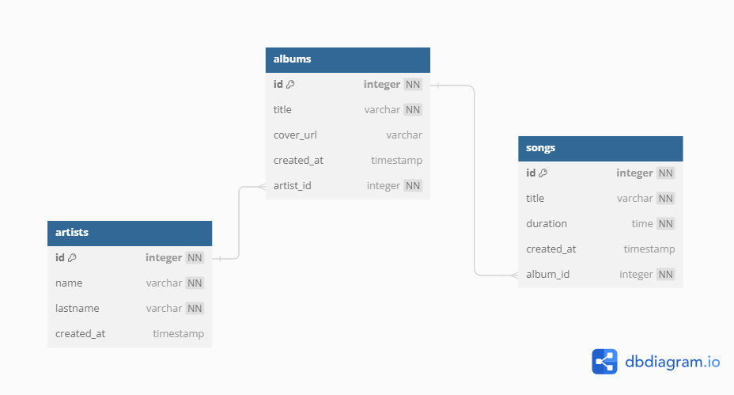

# Spring Boot Integration Testing

## 1. Overview

This repository is intended to provide a sample Spring Boot project for those who wish to learn and practice integration testing. The main idea is to provide a “playground”, 
so that whoever makes use of this repository only focuses on implementing tests without worrying about developing the functionality of the application.
Explanations will be provided on the importance of  integration testing, as well as examples and proposed exercises to practice.

### 2. About the application

This sample project is a simple Spring Boot project emulating a music store. It exposes REST APIs to execute CRUD operations over resources like Artists, Albums and Songs.  
It uses an in-memory database called H2, so you'll find pre-existing data examples.

#### Database schema

### 3. Environment prerequisites

1. Install [JDK 21](https://adoptium.net/temurin/releases/)

### 4. Build instructions

1. Fork this repository
2. Once fork is complete, clone the repository.
3. Open the project with your favourite editor/IDE (Eclipse, VSCode, IntelliJ, etc.).
4. Open a new terminal, move to the project's location and execute the command `.\gradlew clean build` and wait for completion
5. Finally, execute the application using your editor/IDE or executing `.\gradlew bootRun`

If you want to verify application is running you can open the: [Swagger documentation](http://localhost:8080/music-store/swagger-ui/index.html)

You should see something like this:

Here, you'll find the resources to execute CRUD operations for Artists, Albums and Songs. For example,
you can get the lists of artists:

1. In the artists section look for the GET API "Returns a paginated list of artists", click on it and then click on the `Try it out` option.

2. Then click on `Execute` option.

3. You should see a list of artists

